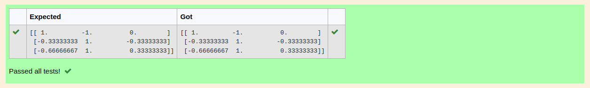

# INVERSE-OF-A-MATRIX
## Aim:
To write a python program to find the inverse of a matrix
## Equipment’s required:
1. 	Hardware – PCs
2. 	Anaconda – Python 3.7 Installation / Moodle-Code Runner
## Algorithm:

Step 1: import numpy as np
Step 2: give the elements of the array
Step 3: the formula is np.linalg.inv()
Step 4: print the result

## Program:
```python
#Program to find the inverse of a matrix.
#Developed by: PRAVEEN BV
#RegisterNumber: 22003834
import numpy as np
A=np.array([[2,1,1],[1,1,1],[1,-1,2]])
B=np.linalg.inv(A)
print(B)
```

## Output:

## Result:
Thus the inverse of given matrix is successfully solved using python program

